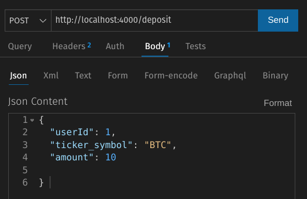
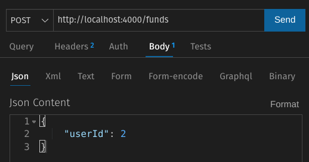

# proyecto-bases-de-datos-CEX
1)
  clone the repo
```sh
git clone https://github.com/juanbailon/proyecto-bases-de-datos-CEX.git
```
<br>

2)
 ingrese a prostgresSQL en la terminal y ejecute los siguientes comandos, postgres debe de estar instalado en su maquina local (**NO** Docker). Todos estos comandos estann en el archivo _database/bd.sql_
```sql
CREATE DATABASE crypto_exchange;
```

selecione ta BD creada anterioemente
```sql
$ \c crypto_exchange;
```

ejecute lso siguientes comandos

```sql

CREATE TABLE users (
  user_id SERIAL PRIMARY KEY,
  email VARCHAR(45) NOT NULL UNIQUE,
  password VARCHAR(64) NOT NULL
  );

  CREATE TABLE coins (
    ticker_symbol VARCHAR(6) PRIMARY KEY,
    coin_name VARCHAR(40) NOT NULL UNIQUE
  );

  CREATE TABLE user_coins (
    id SERIAL PRIMARY KEY,
    user_id integer NOT NULL,
    ticker_symbol VARCHAR(6) NOT NULL, 
    total integer,
    available integer,
    in_orders integer,
    in_liq_pools integer,

    CONSTRAINT fk_user
      FOREIGN KEY(user_id) 
	    REFERENCES users(user_id)
	    ON DELETE CASCADE,

    CONSTRAINT fk_coin
      FOREIGN KEY(ticker_symbol) 
	    REFERENCES coins(ticker_symbol)
	    ON DELETE CASCADE 
  );
  
  CREATE TABLE coin_exchange (
    transaction_id SERIAL PRIMARY KEY,
    user_id integer NOT NULL,
    input_coin VARCHAR(6) NOT NULL,
    output_coin VARCHAR(6) NOT NULL,
    input_amount DOUBLE PRECISION NOT NULL,
    output_amount DOUBLE PRECISION,
    fee_percentage NUMERIC(4,2),

    CONSTRAINT fk_user
      FOREIGN KEY(user_id) 
	    REFERENCES users(user_id)
	    ON DELETE CASCADE
  );
  
  CREATE TABLE orders (
  order_id SERIAL PRIMARY KEY,
  transaction_id integer NOT NULL,
  creation_date TIMESTAMP NOT NULL DEFAULT CURRENT_TIMESTAMP,
  close_date TIMESTAMP,
  order_type VARCHAR(6) NOT NULL CHECK ( order_type='limit' OR order_type='market' ),
  execution_price DOUBLE PRECISION,  

  order_book_id integer NOT NULL,

  side VARCHAR(4),
  status VARCHAR(15)
);


CREATE TABLE trades (
  trade_id SERIAL PRIMARY KEY,
  order_id_1 integer NOT NULL,
  execution_date TIMESTAMP DEFAULT CURRENT_TIMESTAMP,
  execution_price DOUBLE PRECISION,
  order_id_2 integer NOT NULL,

  CONSTRAINT fk_order_id_1
      FOREIGN KEY(order_id_1) 
	    REFERENCES orders(order_id)
	    ON DELETE CASCADE,

  CONSTRAINT fk_order_id_2
      FOREIGN KEY(order_id_2) 
	    REFERENCES orders(order_id)
	    ON DELETE CASCADE
);


CREATE TABLE order_book (
  order_book_id integer NOT NULL PRIMARY KEY,
  exchange_pair VARCHAR(13) NOT NULL,
  coin_1 VARCHAR(6) NOT NULL,
  coin_2 VARCHAR(6) NOT NULL,

  bid_book_id integer,
  ask_book_id integer
);


CREATE TABLE bid_book (
  bid_book_id integer NOT NULL,
  order_book_id integer NOT NULL,
  order_id integer NOT NULL,

  CONSTRAINT fk_order
      FOREIGN KEY(order_id) 
	    REFERENCES orders(order_id)
	    ON DELETE CASCADE,

  CONSTRAINT fk_order_book
      FOREIGN KEY(order_book_id) 
	    REFERENCES order_book(order_book_id)
	    ON DELETE CASCADE,

  PRIMARY KEY(bid_book_id, order_book_id, order_id)

);


CREATE TABLE ask_book (
  ask_book_id integer NOT NULL,
  order_book_id integer NOT NULL,
  order_id integer NOT NULL,

  CONSTRAINT fk_order
      FOREIGN KEY(order_id) 
	    REFERENCES orders(order_id)
	    ON DELETE CASCADE,

  CONSTRAINT fk_order_book
      FOREIGN KEY(order_book_id) 
	    REFERENCES order_book(order_book_id)
	    ON DELETE CASCADE,

  PRIMARY KEY(ask_book_id, order_book_id, order_id)

);


ALTER TABLE orders
  ADD CONSTRAINT fk_order_book
  FOREIGN KEY (order_book_id)
  REFERENCES order_book(order_book_id)
  ON DELETE CASCADE;
  
  
 CREATE TABLE exchange_pair_books (
  exchange_pair VARCHAR(13),
  order_book_id integer,
  bid_book_id integer NOT NULL,
  ask_book_id integer NOT NULL,

  PRIMARY KEY(exchange_pair, order_book_id)
);


ALTER TABLE orders
ADD CONSTRAINT fk_coin_exchange
FOREIGN KEY (transaction_id)
REFERENCES coin_exchange(transaction_id)
ON DELETE CASCADE;


CREATE TABLE liquidity_pools (
  liquidity_pool_id SERIAL PRIMARY KEY,
  exchange_pair VARCHAR(13) NOT NULL,
  coin_1 VARCHAR(6) NOT NULL,
  coin_2 VARCHAR(6) NOT NULL,
  amount_coin_1 DOUBLE PRECISION,
  amount_coin_2 DOUBLE PRECISION,
  estimated_apy NUMERIC(4,2)
);


CREATE TABLE liquidity_providers (
  liquidity_provider_id SERIAL PRIMARY KEY,
  user_id integer NOT NULL,
  amount_coin_1 DOUBLE PRECISION,
  amount_coin_2 DOUBLE PRECISION,
  singin_date TIMESTAMP NOT NULL DEFAULT CURRENT_TIMESTAMP,
  logout_date TIMESTAMP,
  liquidity_pool_id integer,

  CONSTRAINT fk_liquidity_pool
        FOREIGN KEY(liquidity_pool_id) 
        REFERENCES liquidity_pools(liquidity_pool_id)
        ON DELETE SET NULL
);

INSERT INTO coins (ticker_symbol, coin_name) 
  VALUES ('BTC', 'bitcoin'),
         ('USDT', 'tether_USD'),
         ('ADA', 'cardano_ADA');

INSERT INTO order_book (order_book_id, exchange_pair, coin_1, coin_2, bid_book_id, ask_book_id ) 
  VALUES (1, 'BTC/USDT', 'BTC', 'USDT', 1, 1 ),
         (2, 'ADA/USDT', 'ADA', 'USDT', 2, 2 ); 

INSERT INTO liquidity_pools (exchange_pair, coin_1, coin_2, amount_coin_1, amount_coin_2, estimated_apy ) 
  VALUES ('BTC/USDT', 'BTC', 'USDT', 20, 2000, 4 );   


INSERT INTO exchange_pair_books(exchange_pair, order_book_id, bid_book_id, ask_book_id)
  VALUES ('BTC/USDT', 1, 1, 1),
         ('ADA/USDT', 2, 2, 2);         

```

<br>

3.
 configure las credenciales  para acceder a la base de datos, en el archivo **src/db.js**
<br>
-- ejemplo:

```js
const pool = new Pool( {
    user: 'postgres',
    password: 'pg123',
    host: 'localhost',
    port: 5432,
    database: 'crypto_exchange'
} );

```

4) 
Abra una terminal y dirijase a la ubicacion donde estan todos los archivos, una vez ahi ejecute lo siguente
```sh
your-path/proyecto-bases-de-datos-CEX$ npm install
```
luego ejecute
```sh
your-path/proyecto-bases-de-datos-CEX$ npm run dev
```

<br>

5)
 Usando una herramienta para usar la API, como por ejemplo _postman_, para las siguientes explicaciones usaremos Thunder Client, el cual lo podra encontrar en las extenciones de visual studio code

 <br>

6)
 en thunder client coloque http://localhost:4000/sign-up y realice un **POST** para asi crear un nuevo usuario, coloque lo siguiente en el *body* del request(de click en la opcion Body y luego en la opcion Json, que presenta thunder client)
<br>
en el campo de texto que se le presenta coloque lo siguiente, presione ctrl+s al final de escribir:


<br>

Press **Send**, then you should get a response like this 


<br>

7) 
Cree como minimo 2 usuarios, si desea ver los usuarios creados haga el siguinte query en la base de datos
```sql
 SELECT * FROM users;
```

<br>

8)
 Ahora añada fondos a los usuarios que creo, haga un request **POST** a http://localhost:4000/deposit, de la siguiente forma (Presione ctrl + s, en la zona del json antes del envio)


> _NOTA:_ Las monedas soportadas son las siguientes: _bitcoin,  cardano ada, tether usd_; las cuales tienen los ticker_symbol correspondientes  **BTC**, **ADA**, **USDT**
>


Presione **Send**, obtendra la siguiente respuesta


<br>
<br>

> para los siguientes ejemplos se crearon 3 usuarios, con fondos de la siguiente forma: 
>
> - (usuario_1, 10 BTC, 8000 USDT);
> - (usuario_2, 8 BTC, 12000 USDT);
> - (usuario_3, 500 ADA)
>
<br>
De no recordar el user_id, puede hacer cualquiera de las dos siguienttes cosas

- Hacer una peticion **GET** a http://localhost:4000/my-account/:email

<br>
<br>
obtendra esta la siguente respuesta


<br>

- Hacer un SELECT a la tabla users
```sql
    SELECT * FROM users;
```
<br>
<br>

9)
 para esta parte crearemos nuestras primeras ordenes limite.
 
 >primero se deben de hacer estas, ya que en el dessarrollo solo se contemplo para el caso de las ordenes de mercado en el cual ya existe liquidez sucifiente en los libros.

 > Tambien se debe tener en cuenta que no debe ingresar ordenes que no se puedan ejecutar de forma completa, ya que no se tuvo en cuenta el uso de ordenes parciales

 > si segue los ejemplos dados todo saldra bien, ya que para estos se tuvo lo anteriormente mencionado en cuenta

<br>
<br>

  Hacer una peticion **POST** a http://localhost:4000/trade , de la siguiente forma

 > En el programa se tiene solo dos pares de intercambio (exchange_pair), los cuales son:
 > 
 > - BTC/USDT
 > - ADA/USDT

 La parte _**price**_ indica el precio al que se desea vender en terminos de la segunda moneda del _**exchange_pair**_.
 <br>
 El _**input_amount**_ es la cantidad del _**input_coin**_ que se desea cambiar
 <br>
 El _**output_coin**_ es la modena que se desea recibir una vez realizado el intercambio.
 <br>
 El _**exchange_pair**_ nos indica las dos monedas que se pueden intercambiar

 
  
  Al precionar **Send**(recuerede dar ctrl+s en la parte del json) obtendra la siguiente respuesta
 
```js
{
  "message": "limit order created sucesfully"
}
```
<br>
procederemos a crear otras 3 ordernes limite con los siguientes valores:
<br> 

```json
{
    "userId": 1,
    "input_coin": "BTC",
    "output_coin": "USDT",
    "input_amount": 2,
    "price": 2000,
    "exchange_pair": "BTC/USDT",
    "order_type": "limit"
}
```

```json
{
    "userId": 2,
    "input_coin": "BTC",
    "output_coin": "USDT",
    "input_amount": 2,
    "price": 2000,
    "exchange_pair": "BTC/USDT",
    "order_type": "limit"
}
```

```json
{
    "userId": 2,
    "input_coin": "USDT",
    "output_coin": "BTC",
    "input_amount": 1000,
    "price": 2000,
    "exchange_pair": "BTC/USDT",
    "order_type": "limit"
}
```

<br>
<br>

10) 
Para ver TODAS las ordenes realizadas por un usuario realice una peticion **GET** a http://localhost:4000/orders/:id


como resultado se obtendria una lista con todas las ordenes realizadas por el usuario con _**user_id**_ = 2

<br>

Hay otra forma de hacerlo, esta traera solo las ordenes que esten cerradas o abiertas, y es realizando un **POST** a http://localhost:4000/orders , con un body que contenga lo siguiente

```json
{
    "userId": 2,
    "status": "close"
}
```
Esto nos treria todas las ordenes cerradas(ya terminadas, intercambiadas con exito) del user_id = 2. El **status** tiene solo dos estados _**open**_ o _**close**_

<br>

Si se desea ver las ordenes de todos los usuarios, entonces debera ejecutar la siguiente consulta en la base de datos

```sql
    SELECT * FROM orders;
```
<br>

_**NOTA:**_ hasta heste momento por la forma y cantidades en las que realizamos las ordenes limite, no se ha realizado ningun trade/intercambio.

<br>
<br>

11)
 Ahora, para rebizar los fondos de un usuario haremos lo siguiente. Realizamos un **POST** a http://localhost:4000/funds 


<br>

Para el caso anterior obtendriamos como respuesta:
<br>


<br>
<br>

12) Ahora realizaremos la creacion de una orden de mercado(**market**), lo haremos de la siguiente forma, realizamos un **POST** a  http://localhost:4000/trade 

<br>

>Aqui veremos nuestro primer intercambio.


<br>

Ahora debido a la accion que acabamos de realizar, si revisamos los fondos del user_id=2 este trendra 3 bitcoin de mas, y 5000 usd menos.

Esos 3 bitcoins que se intercambieron salieron de las 2 ordenes limite que hizo el user_id=1 en el paso 9, y a cambio recibio 5000 USDT que fue la cantidad ingresada por user_id=2 al momento de realizar su orden de mercado.

Dedido a lo anterior ahora tendriamos 3 ordenes con un **status** = 'close', ya que se realizaron trades para dos ordes limite y una orden de mercado (las mencionadas anteriormente)

<br>
<br>

12)
 Ahora crearemos dos ordenes limit, para que se genere un intercambio entre ambas ordenes limite.

 siguiendo los pasos del punto 9, creamos ambas ordenes con las siguientes especificaciones:

 ```json
 {
    "userId": 1,
    "input_coin": "USDT",
    "output_coin": "ADA",
    "input_amount": 200,
    "price": 2,
    "exchange_pair": "ADA/USDT",
    "order_type": "limit"
}
 ```

 ```json
 {
    "userId": 3,
    "input_coin": "ADA",
    "output_coin": "USDT",
    "input_amount": 100,
    "price": 2,
    "exchange_pair": "ADA/USDT",
    "order_type": "limit"
}
```

<br>

una vez realizadas las ordenes, podremos ver consultando los fondos de user_id=1 y user_id=3, que los interncambios fueron realizados, y ahora el user_id=3 tiene una nueva moneda en sus fondos(USDT), y el usuario_id=1 tambien(ADA).

<br>

13) 
Si uno de los usuarios deseara cancelar una de sus ordenes, debera hacer lo siguiente, debera hacer una peticion **DELETE** a http://localhost:4000/orders

> **NOTA:** solo se puden cancelar las ordenes limite cuyo estatus es _**open**_. Para conocer el order_id busque entre sus ordenes, siga los pasos del punto 10

Ya que user_id=2 aun tiene dos ordenes limite abiertas, cancelaremos una de ellas.


<br>

si revisamos nuestras ordenes nuevamente veremos que una de las ordenes ya no esta, ya que fue eliminada.


